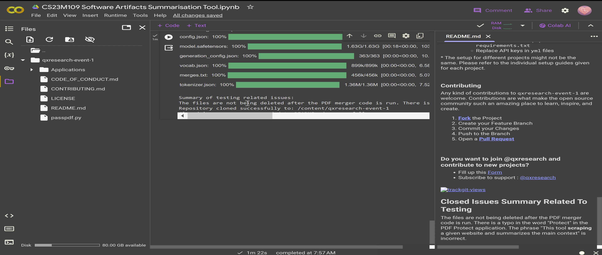

# CS23M109 Software Artifacts Summarisation Tool

## Problem Statement

The problem is to create a tool for Software Artifacts Summarisation. The tool assists testers in identifying closed issues related to testing by providing the GitHub repository URL. It then summarises these issues and appends the summary to the README file of the cloned GitHub repository.

## Solution Overview

### Functions Implemented:

1. **Fetching Closed Issues**:  
   Constructs a GitHub API URL to fetch closed issues of a repository and returns the JSON response.
  
2. **Printing Unique Closed Issues**:  
   Prints unique closed issues sorted by their creation date using a set to avoid duplicates.

3. **Generating Testing-Related Issues**:  
   Combines issue titles and bodies to generate content using GenAI's GenerativeModel to identify testing-related issues.

4. **Summarising Issues**:  
   Summarises testing-related issues using Transformers' BART model for text summarization.

5. **Cloning Repository**:  
   Clones the GitHub repository to a specified destination path, removing the directory if it already exists.

6. **Appending Summary to README**:  
   Appends the generated summary to the README file of the cloned repository.

### Libraries and Techniques Used:

**Techniques:**
- API Requests
- Natural Language Generation (GenAI)
- Text Summarization (Transformers)
- Version Control (Git)

**Libraries Used:**
- `os`: For operating system dependent functionality.
- `google.generativeai`: GenAI for natural language generation.
- `requests`: For making HTTP requests to the GitHub API.
- `urllib.parse`: For parsing URLs.
- `transformers`: For text summarization using the BART model.
- `git`: For cloning GitHub repositories.
- `shutil`: For high-level file operations like directory removal.

## Results

The tool prints unique closed issues sorted by creation date, identifies testing-related issues, generates a summary of these issues, clones the GitHub repository locally, and appends the summary to the README file.

## New Learnings

- Integration of GenAI using Gemini LLM model for content filtering.
- Text summarization using Transformers.
- Git Python library for repository cloning.
- Python error handling and debugging.
- URL parsing and manipulation with `urllib.parse`.

## Running Instructions

### Pre-requisites:

- Upload the `CS23M109 Software Artifacts Summarisation Tool.ipynb` file to Google Colab.

### Steps:

1. **Run Each Function**:  
   Execute each function in separate cells.

2. **Run Main Function**:  
   Execute the script to run the main function.

3. **Input GitHub URL**:  
   Input the GitHub repository URL when prompted.

4. **View Results**:  
   The tool will print closed issues, filtered testing-related issues, and append the summary to the README file.

### Checking Appended Summary to README:

- Open the left-side menu in Colab.
- Refresh the files section.
- A new directory named after the repository will appear.
- Click the dropdown menu to open the README file.
- Check under the section titled "Closed Issues Summary Related To Testing" for the appended summary.

### Additional Dependencies:

- **GitPython library** needs to be installed to handle GitHub API and related methods.
  
Most dependencies are pre-installed in Colab, and only the GitPython library needs to be installed.
